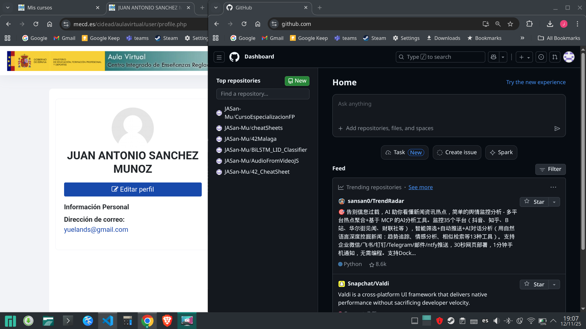
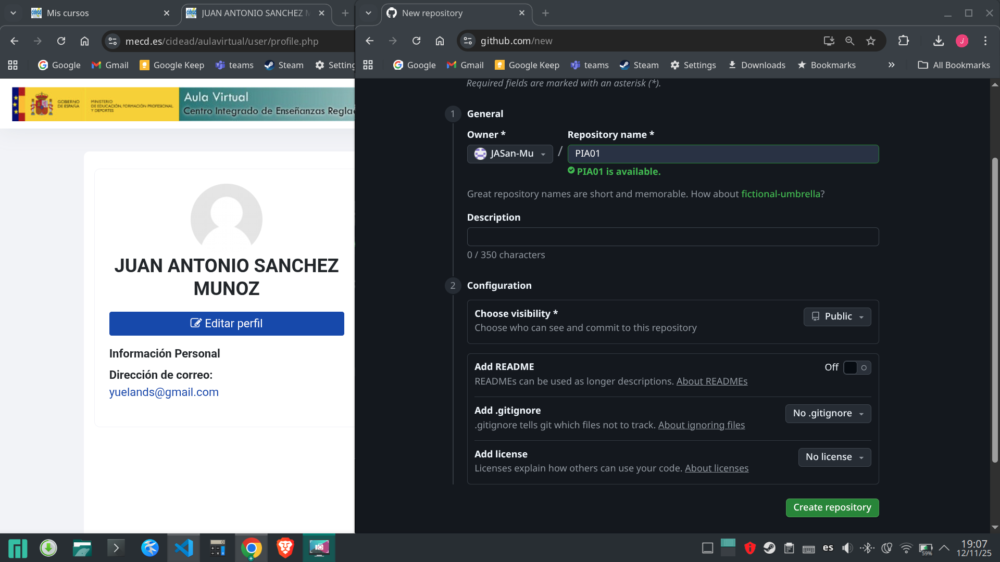
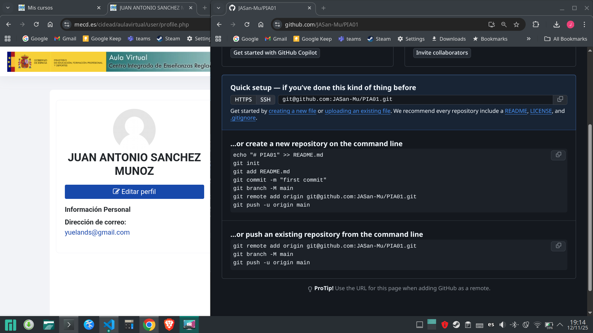
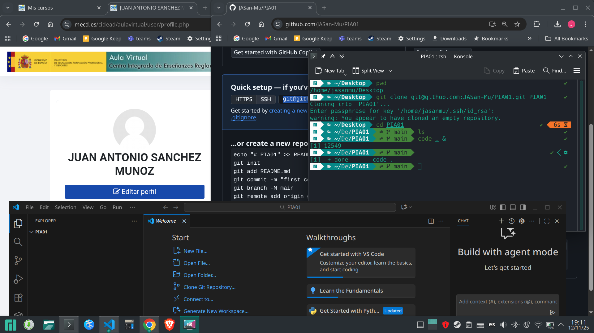
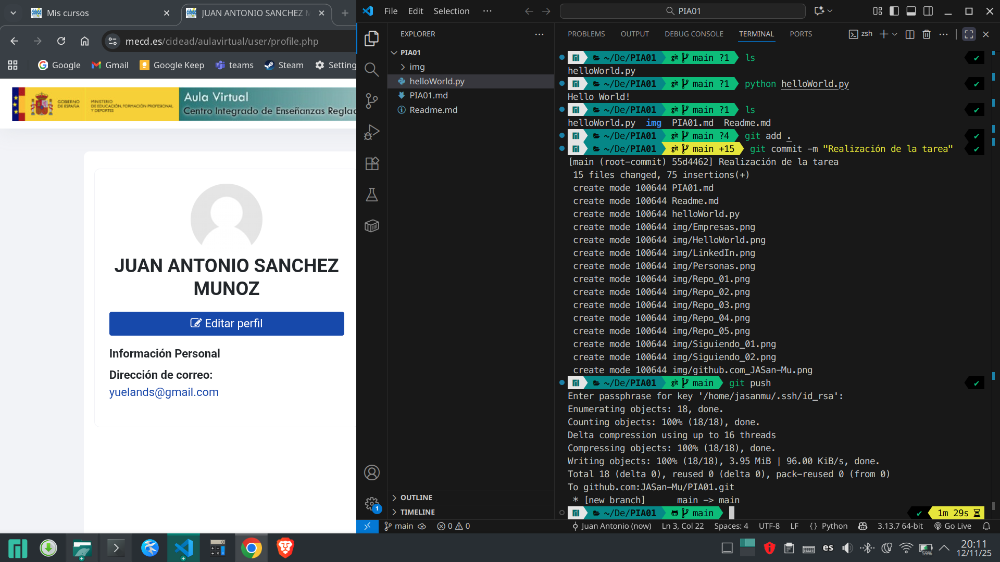
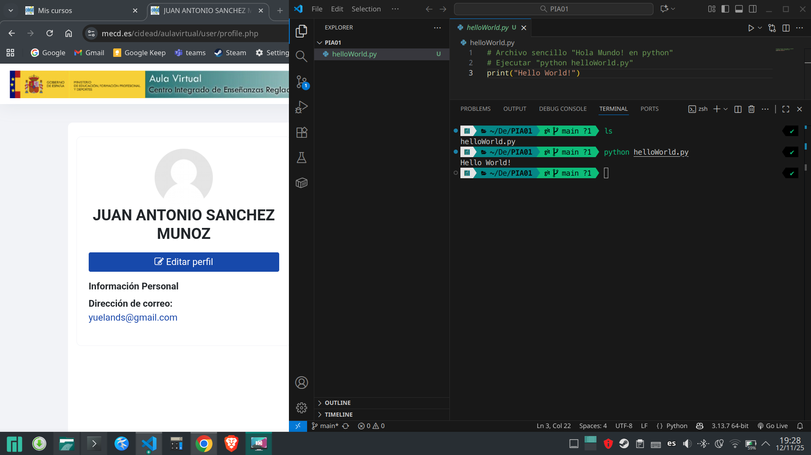
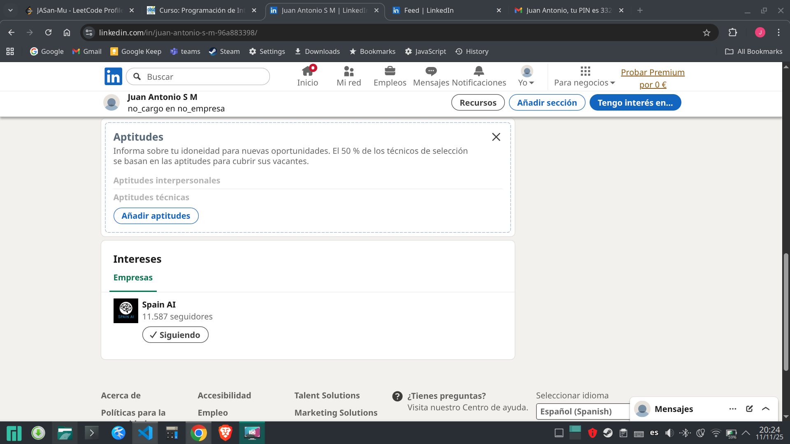
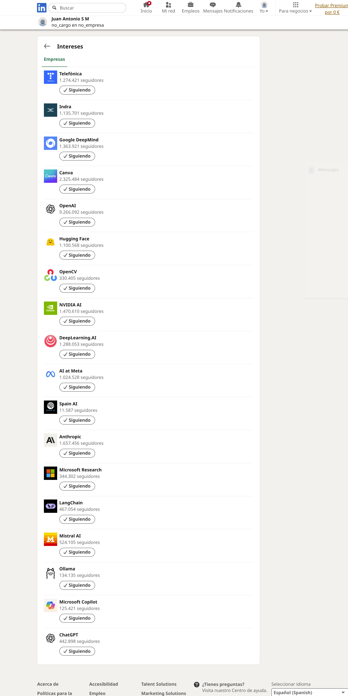
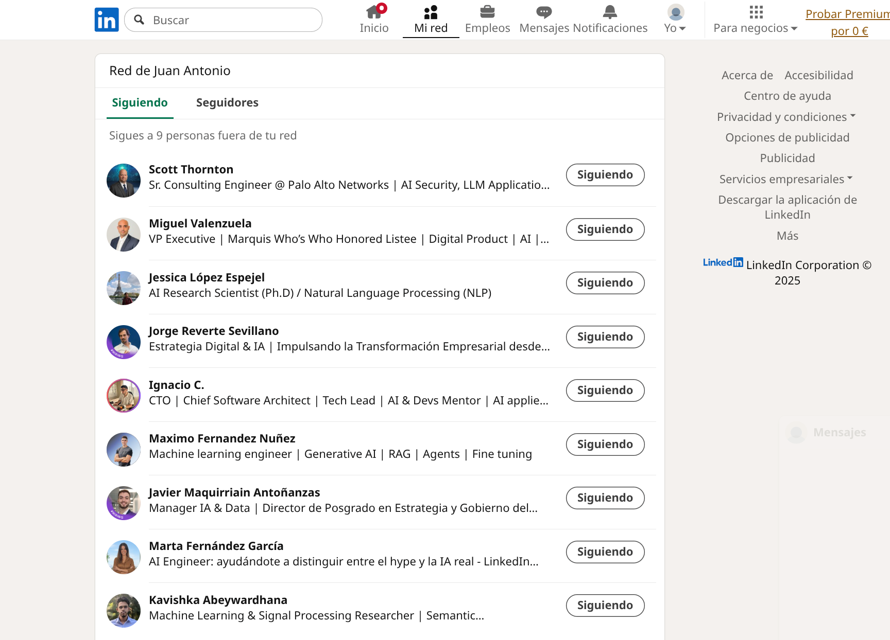
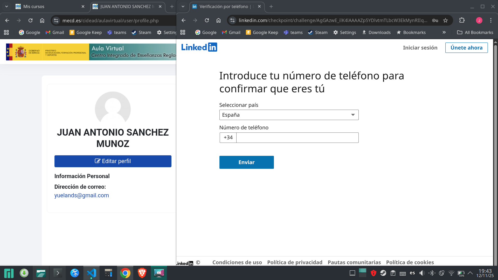

# Actividad 01
## Apartado 1: Crear cuenta en GitHub y crear "Hola Mundo"
Accede a la página web de **GitHub** y sigue los pasos para registrarte y crearte una cuenta. Cuando se te pida que especifiques si eres alumno o profesor, pulsa en la opción que aparece en la parte inferior de la pantalla "skip personalization". Tras concluir el proceso de registro, crea tu primer **repositorio**, incluyendo, de momento, un archivo Readme en el que añadas, con lenguaje de marcación, una breve explicación de la tarea, y un archivo sencillo "Hola Mundo" en el **lenguaje de programación Python**. 

Ya se dispone de cuenta en Github. Procedo a crear el repositorio para la tarea.
### Creando un repositorio
[Repositorio en Github](https://github.com/JASan-Mu/PIA01)
1. Crear nuevo repositorio, se pulsa en el botón "New"

2. Confirmar la creación del repositorio, configuramos lo que sea necesario y pulsamos en "Create Repository". En este caso dejo el campo de añadir el archivo "Readme" en "off" porque lo voy a crear yo mismo, aunque también le podríamos activar la opción para que lo cree automáticamente.

3. Repositorio vacío creado (nos avisa que hemos creado un repositorio vacío)

4. Aquí hay muchas opciones, como yo ya dispongo de las herramientas instaladas (git, ssh, etc.) procedo a descargar el repositorio, añadirle los archivos necesarios y subirlo nuevamente. Utilizo VS code como IDE para la creación de los mismos. Nos avisa que hemos clonado un repositorio vacío, como ya he dicho crearé los archivos en VS Code.

5. Finalmente se sube nuevamente al repositorio aprovechando las funcionalidades de git, (esta última captura tiene un desfase con respecto a las anteriores ya que antes de poder subir los archivos hay que crearlos y dicho proceso se detalla en un paso posterior en esta misma tarea):


### Creando un archivo sencillo de la tarea
Crear un programa sencillo "Hola Mundo" en python.
1. Creamos un archivo "helloWorld.py"
2. Añadimos el siguiente código:
```python
print("Hello World!")
```
3. Para ejecutar este archivo, necesitamos en primer lugar tener instalado el intérprete de python [Enlace a página de descargas de python](https://www.python.org/downloads/)
4. Una vez que ya tenemos instalado el intérprete de python, podemos abrir un terminal y ejecutar
```console
python helloWorld.py
```
5. Debemos obtener la salida:
```console
Hello World!
```

6. Una vez comprobado el ejemplo, ya se puede subir a GitHub.  
[Consultar punto 5 de "Creando un repositorio"](#creando-un-repositorio)
## Apartado 2: Conectar con la comunidad en redes sociales. Dos opciones a elegir.
- Si tienes cuenta en **Twitter**:  
Crea una lista y nómbrala con alguna alusión a la inteligencia artificial
    1. Haz una búsqueda de perfiles interesantes que compartan cosas relacionadas con la IA y ve añadiéndoles a la lista que has creado
    2. Busca listas que hayan creado otros en torno a lenguajes de programación como Python, R o C++ y sigue alguna de ellas que veas con buenos contenidos.  
- Si tienes perfil en **Linkedin**:   
[Enlace al perfil de Linkedin](https://www.linkedin.com/in/jasanmu/) 
    1. Sigue a [Comunidad Spain AI](https://www.linkedin.com/company/spainai/?originalSubdomain=es)
    
     
    2. Busca profesionales o expertos en el ámbito de la inteligencia artificial y sígueles.
        - Se empieza por seguir a las principales empresas de AI, empresas locales como telefónica e indra, etc.
        
        - Se siguen a perfiles profesionales dedicados a la inteligencia artificial. Por la forma en la que trabaja Linkedin, habría que tratar de mandar mensajes y "conectar" para poder seguir alguno de los perfiles más interesantes. Por último, lo más interesante sería seguir los perfiles de reclutadores en empresas tecnológicas (hay bastantes), pero esa parte no se pide en la práctica.
        


### NOTA IMPORTANTE

Para todos los apartados es necesario entregar los enlaces de acceso al repositorio y listas creados, así como las capturas de pantalla de los principales pasos realizados, con una breve explicación. 
- [Repositorio en Github](https://github.com/JASan-Mu/PIA01)
- [Enlace al perfil de Linkedin](https://www.linkedin.com/in/jasanmu/) 
- [Lista de personas seguidas en Linkedin](https://www.linkedin.com/mynetwork/network-manager/people-follow/following/)  

### INCIDENCIAS CON LA TAREA

Al darme cuenta de que he hecho mla las capturas, (no aparece la página con el nombre del usuario...), he intentado volver a tomarlas pero ya no me deja entrar de nuevo a LinkedIn.
